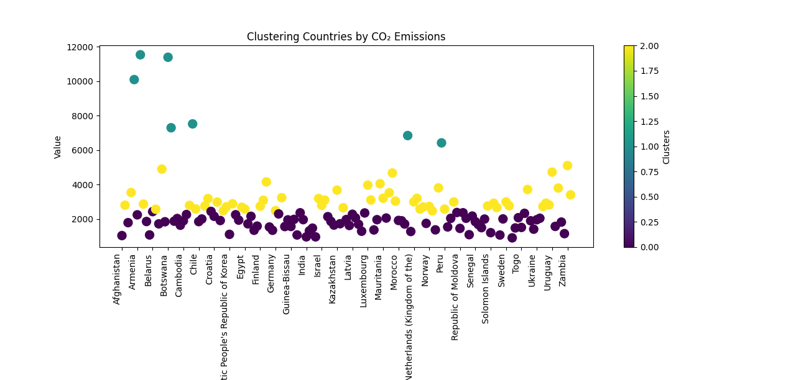

# 🌍 FootPrint AI

**FootPrint AI** identifies patterns in global carbon emissions by grouping countries into clusters based on their emission levels.  
This helps highlight similarities, differences, and outliers, offering insights that can support **climate policy**, **sustainability planning**, and **environmental awareness**.

It uses **K-Means clustering** on carbon emission data to segment countries into distinct groups, making it easier to visualize and compare their environmental impact.

---

## 📊 Clustering Visualization

Below is the output plot showing the clusters:



---

## 🔍 Cluster Interpretation

- **Cluster 0 (Low Emission)** – Countries with minimal carbon emissions, often smaller economies or those relying on renewable energy.  
- **Cluster 1 (Medium Emission)** – Countries with moderate industrialization and balanced energy mix.  
- **Cluster 2 (High Emission)** – Highly industrialized or fossil fuel–dependent nations with significant emissions.

---

## 🛠 How It Works

1. **Data Collection** – Carbon emission data by country is loaded from a CSV dataset.  
2. **Preprocessing** – Missing values handled, relevant columns extracted.  
3. **Clustering** – K-Means algorithm groups countries based on their emissions.  
4. **Visualization** – Matplotlib & Seaborn used to display clusters clearly.  

---

## 📦 Requirements

```bash
pip install pandas numpy matplotlib scikit-learn
